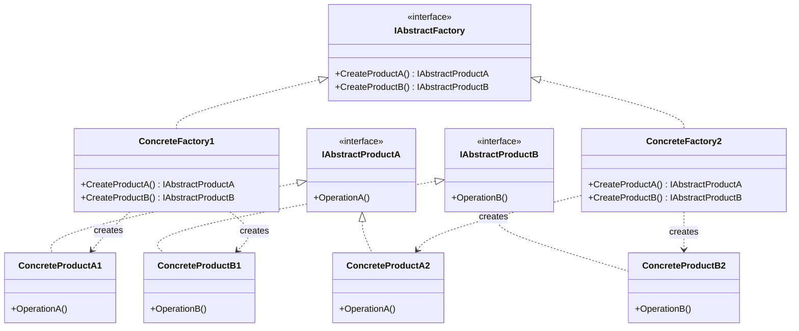

# Abstract Factory

The Abstract Factory is a creational design pattern that lets you produce families of related objects (or products) without specifying their concrete classes. It is particularly useful when your system needs to be independent of how its products are created, composed, and represented.

# Diagram
