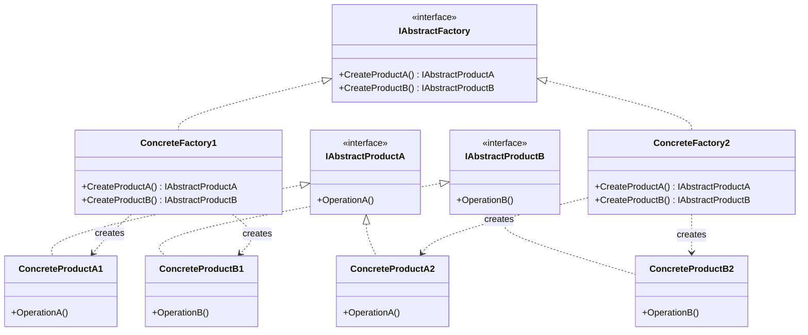

# Abstract Factory

The Abstract Factory is a creational design pattern that lets you produce families of related objects (or products) without specifying their concrete classes. It is particularly useful when your system needs to be independent of how its products are created, composed, and represented.

# Diagram

# Roles

| Abstract Factory Role | Generic Description | Domain Implementation |
| --- | --- | --- |
| **Abstract Factory** (`ICommercialBankingFactory`) | Declares an interface for operations that create abstract product objects. | `ICommercialBankingFactory` defines creation methods (`CreateBankingGuarantee()`, `CreateBusinessOverdraft()`) for commercial banking products. |
| **Concrete Factory 1** (`CoroporateBankingFactory`) | Implements the creation operations to produce concrete products of a specific variant. | `CoroporateBankingFactory` implements the factory interface to build high-limit corporate facilities. |
| **Concrete Factory 2** (`SmallBusinessBankingFactory`) | Implements creation operations for a different structural variant. | `SmallBusinessBankingFactory` implements the factory interface to build streamlined, smaller-scale products. |
| **Abstract Product A** (`IBankGuarantee`) | Declares an interface for a type of product object. | `IBankGuarantee` defines standard contract operations (`GetGuaranteeAmount()`, `GetBeneficiary()`). |
| **Abstract Product B** (`IBusinessOverdraft`) | Declares an interface for a second type of product object. | `IBusinessOverdraft` defines standard line-of-credit operations (`GetOverdraftLimit()`). |
| **Concrete Product A1 / A2** (`CorporateBankGuarantee`, `SmallBusinessGuarantee`) | Specific products created by the corresponding concrete factory, implementing the product interface. | `CorporateBankGuarantee` and `SmallBusinessGuarantee` represent the concrete variants built by their respective factories. |
| **Concrete Product B1 / B2** (`CorporateBusinessOverdraft`, `SmallBusinessOverdraft`) | Specific secondary products created by the corresponding concrete factory. | `CorporateBusinessOverdraft` and `SmallBusinessOverdraft` handle the distinct business overdraft implementations. |

