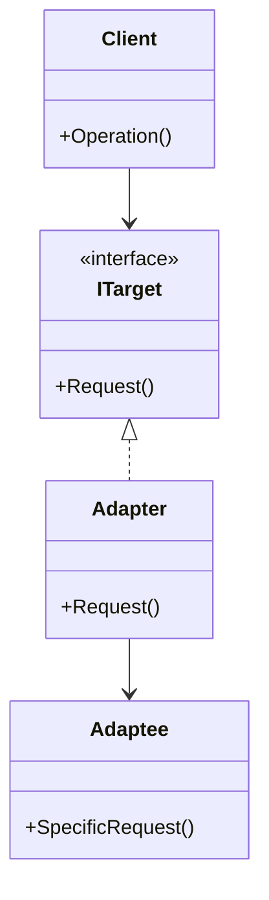

# Adapter

The Adapter is a structural design pattern that allows objects with incompatible interfaces to collaborate. It acts as a wrapper between two objects, translating calls from a client-facing target interface into the format expected by an existing service or legacy component without modifying their original source code.

# Diagram

# Roles

| Role / Component | Generic Responsibility | Domain Implementation |
| --- | --- | --- |
| **Client** | Contains business logic; depends only on the Target interface to get its work done. | **Loan Underwriting Engine** that evaluates risk without knowing vendor details. |
| **Target (Interface)** | The domain-specific contract that the Client expects and understands. | `ICreditBureauService` defining a standard `GetCreditReportAsync()` method. |
| **Adaptee** | The existing, third-party, or legacy service with an incompatible interface or schema. | **Equifax API Client** returning legacy XML strings on an 850 scoring scale. |
| **Adapter** | The wrapper class that implements the Target interface and translates calls into the Adaptee's format. | `EquifaxCreditAdapter` which translates XML, normalizes scores to 1000, and returns a unified `CreditReport`. |

