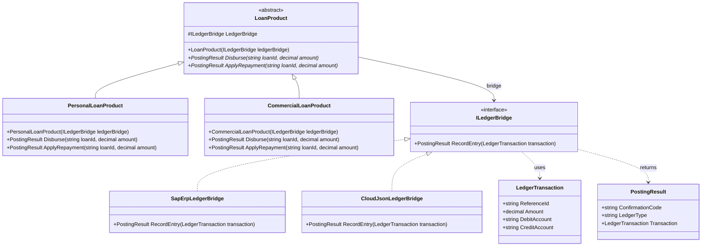

# Bridge Pattern

## Description

The Bridge pattern is a structural design pattern that decouples an abstraction from its implementation so that the two can vary independently. It separates the high-level abstraction (what the object does) from the low-level implementation details (how it does it).

In this implementation, the Bridge pattern separates **LoanProduct** (the domain abstraction for loan products and lifecycle events) from **ILedgerBridge** (the implementor interface for general ledger systems). This allows:

- Adding new loan product types (e.g., `MortgageLoanProduct`, `LineOfCreditProduct`) without modifying ledger integration logic
- Adding new ledger providers (e.g., `NetSuiteLedgerBridge`, `KafkaEventLedgerBridge`) without modifying loan product rules
- Combining any loan product with any ledger backend at runtime

---

## Real-World Analogy: Loan Products & General Ledger Systems

Imagine a commercial lending institution offering various credit facilities:

- **Abstraction Hierarchy (Loan Products):**
  Different loan products have distinct accounting portfolio structures and lifecycle behaviors:
  - `PersonalLoanProduct`: Manages unsecured consumer facilities; books disbursements to Personal Loans Receivable (`1051`) and Cash Settlement (`1010`).
  - `CommercialLoanProduct`: Manages business credit facilities; books to Commercial Loans Receivable (`1052`) and Cash Settlement (`1010`).
  - `MortgageLoanProduct`: Manages secured property facilities with escrow withholdings.
  *The lending product's role is purely financial domain logic: calculating amounts, managing repayment schedules, and generating balanced debit/credit lines.*

- **Implementor Hierarchy (General Ledger Infrastructure — `ILedgerBridge`):**
  The actual book of record where double-entry journals are posted:
  - `SapErpLedgerBridge`: Formats entries for SAP ERP using SAP document numbers and fiscal posting keys (40/50).
  - `CloudJsonLedgerBridge`: Generates cloud-native ledger entries with UUID idempotency keys for distributed event-sourced architectures.
  - `LegacyMainframeLedger`: Generates fixed-width flat files transmitted via midnight SFTP batch transfers.

```
          [ Loan Products ]                 --- Bridge --->           [ General Ledgers ]
   PersonalLoan / CommercialLoan                                SapErpLedger / CloudJsonLedger
  (Calculates portfolio debits/credits)                              (Handles protocol, format, idempotency)
```

**Without the Bridge Pattern ($M \times N$ Class Explosion):**
Every loan product would need a custom implementation for every ledger backend:
`SapPersonalLoanProduct`, `CloudJsonPersonalLoanProduct`, `MainframePersonalLoanProduct`, `SapCommercialLoanProduct`, `CloudJsonCommercialLoanProduct`, `MainframeCommercialLoanProduct`, etc.
If you offer 6 loan products across 3 ledger backends, you are forced to build and maintain **18 distinct classes**. When commercial loan accounting policies change, you would have to update 3 separate classes.

**With the Bridge Pattern ($M + N$ Clean Decoupling):**
The loan product holds a reference to an `ILedgerBridge` interface:
- 2 loan product classes (`PersonalLoanProduct`, `CommercialLoanProduct`)
- 2 ledger bridge classes (`SapErpLedgerBridge`, `CloudJsonLedgerBridge`)
- **Total: 4 classes ($M + N$) instead of $M \times N$.**

Any loan product can post to any ledger at runtime. If the institution integrates a new ledger (e.g. NetSuite), you only write one new `NetSuiteLedgerBridge`, and all existing loan products can immediately book into it without modifying any lending code.

---

## UML Diagram



---

## Role Mapping

| Class / Interface | Bridge Pattern Role | Description |
|-------------------|---------------------|-------------|
| `LoanProduct` | **Abstraction** | Defines the abstract interface for loan products; maintains reference to `ILedgerBridge` |
| `PersonalLoanProduct` | **Refined Abstraction** | Extends the abstraction; configures personal loan accounts (`1051`) for disbursements and repayments |
| `CommercialLoanProduct` | **Refined Abstraction** | Extends the abstraction; configures commercial loan accounts (`1052`) for disbursements and repayments |
| `ILedgerBridge` | **Implementor** | Defines the interface for ledger implementations; the "bridge" between loan products and ledger infrastructure |
| `SapErpLedgerBridge` | **Concrete Implementor** | Implements `ILedgerBridge` for SAP ERP document posting |
| `CloudJsonLedgerBridge` | **Concrete Implementor** | Implements `ILedgerBridge` for cloud event ledgers with UUID idempotency |

---

## Key Advantages

1. **Prevents Class Explosion ($M \times N \rightarrow M + N$)**
   Instead of creating subclasses for every possible combination of loan products and ledger technologies, you maintain two orthogonal, linearly growing class hierarchies.

2. **Decouples Abstraction from Implementation at Runtime**
   Unlike compile-time inheritance, the ledger implementation can be bound or swapped dynamically at runtime (e.g., routing transactions to SAP vs. Cloud Ledger based on tenant or entity configuration).

3. **Follows Single Responsibility & Open/Closed Principles**
   High-level workflow rules are completely isolated from low-level execution mechanics. You can add new loan products or new ledgers without modifying existing code.

4. **Simplifies Unit Testing**
   The abstraction can be thoroughly tested with mock/substitute implementors using NSubstitute without connecting to real ERPs or databases.

5. **Insulates Domain Logic from Vendor/Platform Changes**
   Third-party API updates, driver changes, or protocol revisions are quarantined inside concrete implementors, keeping the core domain clean.

---

## Scenarios: When to Use the Bridge Pattern

### 1. Dual General Ledger / Multi-ERP Integration
**Scenario:** A lending or treasury microservice processes financial events and must post balanced double-entry accounting records into different General Ledger (GL) systems (e.g., a legacy SAP ERP and a modern cloud-native event-driven ledger).

- **Abstraction Hierarchy (Loan Products):**
  - `PersonalLoanProduct`: calculates consumer disbursements and customer repayments.
  - `CommercialLoanProduct`: manages commercial facilities, syndication shares, and interest charges.
  - `MortgageLoanProduct`: handles principal, interest, taxes, and insurance (PITI) splits.
- **Implementor Hierarchy (Ledger Integration Bridge):**
  - `SapErpLedgerBridge`: translates entries into SAP BAPI/IDoc payloads with fiscal-period locks and posting keys (40/50).
  - `CloudJsonLedgerBridge`: posts JSON entries with UUID idempotency keys to a cloud ledger REST API or Kafka topic.
  - `ShadowLedgerBridge`: dual-writes to both systems during core-banking migration for automated reconciliation.

**Why Bridge Fits:** You can add new loan product types without knowing about SAP protocols, and you can swap or migrate GL backends without touching a single accounting rule.

---

### 2. Loan & Margin Pricing Engines
**Scenario:** A commercial lending pricing engine needs to calculate loan interest rates, customer spreads, and profitability margins across multiple credit products.

- **Abstraction Hierarchy (Product Pricing Models):**
  - `FixedRateMortgagePricing`: applies duration modeling, regulatory caps, and risk margins.
  - `RevolvingLineOfCreditPricing`: models utilization fees, draw limits, and floating spreads.
  - `AssetFinancePricing`: models collateral depreciation and residual value risk.
- **Implementor Hierarchy (Market Curve & Benchmark Providers):**
  - `BloombergMarketBridge`: fetches live SOFR / BBSW swap curves via market data sockets.
  - `CentralBankFixingBridge`: reads statutory daily benchmark fixings.
  - `TreasuryFtpBridge`: queries internal cost-of-funds Transfer Pricing tables from internal cache.

**Why Bridge Fits:** Financial pricing models evolve independently from market feed infrastructure and data providers.

---

### 3. Cross-Platform UI & Graphics Engines
**Scenario:** A UI framework running on multiple operating systems (macOS, Windows, Linux).
- **Abstraction:** Window, Dialog, Button, Canvas.
- **Implementor:** DirectXBridge, MetalBridge, VulkanBridge.
- Allows UI widgets to evolve without coupling to low-level graphics shaders and GPU drivers.

---

### 4. Multi-Channel Notification Services
**Scenario:** A customer communications engine.
- **Abstraction:** `SecurityAlertNotification`, `InvoiceReceiptNotification`, `MarketingCampaignNotification`.
- **Implementor:** `TwilioSmsBridge`, `SendGridEmailBridge`, `FcmPushNotificationBridge`.

---

## Bridge vs. Other Patterns

| Pattern | Primary Intent | When to Choose Over Bridge |
|---|---|---|
| **Bridge** | Splits two orthogonal, independently growing hierarchies (Abstraction + Implementation) | When you have variations in **both** what the system does and how it is implemented |
| **Strategy** | Swaps different algorithms or behaviors for a single class | When you only have one dimension of variation (swapping an algorithm, not an entire abstraction hierarchy) |
| **Adapter** | Makes two existing, incompatible interfaces work together | Used as an afterthought to bridge legacy/incompatible code, whereas Bridge is designed intentionally up-front |

---

## Adding a New Ledger Provider

To add a new ledger backend (e.g., NetSuite), you only need to:

### 1. Create a new class implementing `ILedgerBridge`

```csharp
namespace Bridge;

public class NetSuiteLedgerBridge : ILedgerBridge
{
    public PostingResult RecordEntry(LedgerTransaction transaction)
    {
        // NetSuite SuiteTalk API integration
        var confirmationCode = $"NS-JOURNAL-{transaction.ReferenceId}";
        return new PostingResult(confirmationCode, "NetSuite", transaction);
    }
}
```

### 2. Use it with any existing Loan Product - no changes needed

```csharp
// Works immediately with all loan products
ILedgerBridge ledger = new NetSuiteLedgerBridge();
LoanProduct loan = new PersonalLoanProduct(ledger);

var result = loan.Disburse("PL-5001", 10000.00m);
```

### What you DON'T need to modify

| File | Required? |
|------|-----------|
| `LoanProduct.cs` | ❌ No |
| `PersonalLoanProduct.cs` / `CommercialLoanProduct.cs` | ❌ No |
| `ILedgerBridge.cs` | ❌ No |
| Existing ledger classes (`SapErpLedgerBridge`, `CloudJsonLedgerBridge`) | ❌ No |

---

## Adding a New Loan Product

To add a new credit product (e.g., `MortgageLoanProduct`), you only need to:

### 1. Create a new class inheriting from `LoanProduct`

```csharp
namespace Bridge;

public class MortgageLoanProduct(ILedgerBridge ledgerBridge) : LoanProduct(ledgerBridge)
{
    public const string MortgageReceivableAccount = "1053-MORTGAGES-RECEIVABLE";
    public const string SettlementAccount = "1010-CASH-SETTLEMENT";

    public override PostingResult Disburse(string loanId, decimal amount)
    {
        var transaction = new LedgerTransaction(
            ReferenceId: loanId,
            Amount: amount,
            DebitAccount: MortgageReceivableAccount,
            CreditAccount: SettlementAccount);

        return LedgerBridge.RecordEntry(transaction);
    }

    public override PostingResult ApplyRepayment(string loanId, decimal amount)
    {
        var transaction = new LedgerTransaction(
            ReferenceId: loanId,
            Amount: amount,
            DebitAccount: SettlementAccount,
            CreditAccount: MortgageReceivableAccount);

        return LedgerBridge.RecordEntry(transaction);
    }
}
```

### 2. Use it with any existing Ledger Bridge - no changes needed

```csharp
// Works immediately with all ledger backends (SAP, Cloud, NetSuite)
ILedgerBridge sapLedger = new SapErpLedgerBridge();
LoanProduct mortgage = new MortgageLoanProduct(sapLedger);

var result = mortgage.Disburse("MTG-9001", 450000.00m);
```

### What you DON'T need to modify

| File | Required? |
|------|-----------|
| `ILedgerBridge.cs` | ❌ No |
| Existing ledger classes (`SapErpLedgerBridge`, `CloudJsonLedgerBridge`) | ❌ No |
| Existing loan products (`PersonalLoanProduct`, `CommercialLoanProduct`) | ❌ No |

---

## Unit Testing the Bridge with NSubstitute

The Bridge pattern makes unit testing clean because the Abstraction and Implementor can be tested completely independently:

```csharp
[Fact]
public void PersonalLoanProduct_ShouldDisburse_ToPersonalLoanAccounts()
{
    // Arrange: Substitute the implementor bridge
    var ledgerMock = Substitute.For<ILedgerBridge>();
    var loanProduct = new PersonalLoanProduct(ledgerMock);

    ledgerMock.RecordEntry(Arg.Any<LedgerTransaction>())
        .Returns(callInfo => new PostingResult("CONF-001", "MockLedger", callInfo.Arg<LedgerTransaction>()));

    // Act
    var result = loanProduct.Disburse("PL-1001", 15000.00m);

    // Assert: Verify parameters routed across the bridge
    result.ShouldNotBeNull();
    ledgerMock.Received(1).RecordEntry(Arg.Is<LedgerTransaction>(tx =>
        tx.ReferenceId == "PL-1001" &&
        tx.Amount == 15000.00m &&
        tx.DebitAccount == PersonalLoanProduct.ReceivableAccount &&
        tx.CreditAccount == PersonalLoanProduct.SettlementAccount));
}
```

This demonstrates the **Open/Closed Principle**: both dimensions are *open for extension* (new products or new ledgers) but *closed for modification* (existing code unchanged).