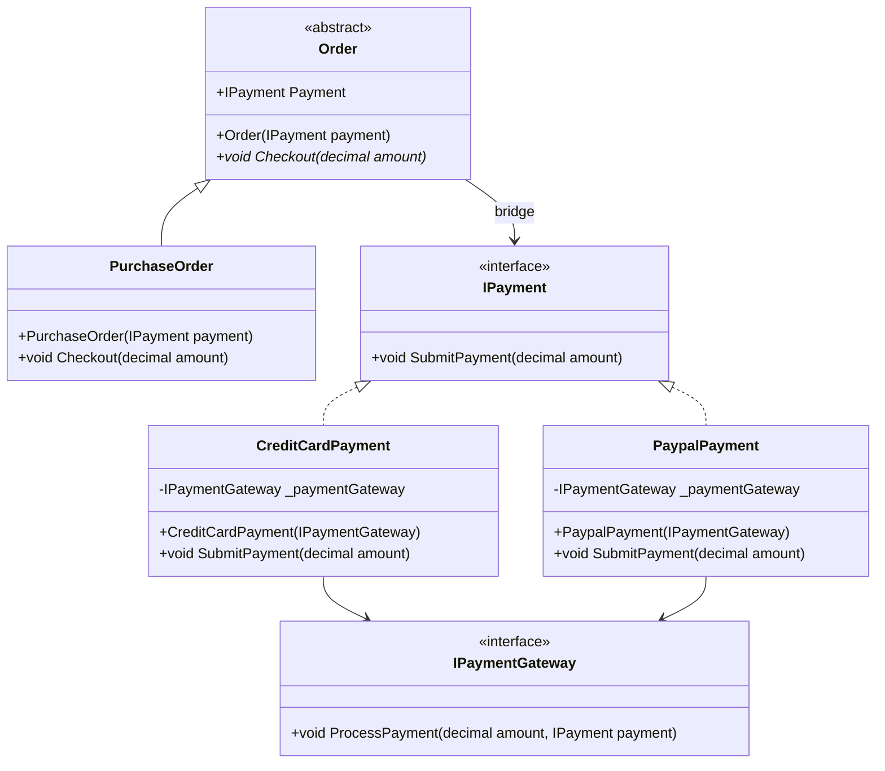

# Bridge Pattern

## Description

The Bridge pattern is a structural design pattern that decouples an abstraction from its implementation so that the two can vary independently. It separates the high-level abstraction (what the object does) from the low-level implementation details (how it does it).

In this implementation, the Bridge pattern separates **Order** (the abstraction for processing orders) from **IPayment** (the implementation for different payment methods). This allows:

- Adding new order types (e.g., `SubscriptionOrder`, `RefundOrder`) without modifying payment logic
- Adding new payment methods (e.g., `ApplePayPayment`, `CryptoPayment`) without modifying order logic
- Combining any order type with any payment method at runtime

## UML Diagram



## Role Mapping

| Class / Interface | Bridge Pattern Role | Description |
|-------------------|---------------------|-------------|
| `Order` | **Abstraction** | Defines the abstract interface for orders; maintains reference to `IPayment` implementor |
| `PurchaseOrder` | **Refined Abstraction** | Extends the abstraction; implements specific order behavior (`Checkout`) |
| `IPayment` | **Implementor** | Defines the interface for payment implementations; the "bridge" between abstraction and concrete implementations |
| `CreditCardPayment` | **Concrete Implementor** | Implements `IPayment` for credit card payments; delegates to `IPaymentGateway` |
| `PaypalPayment` | **Concrete Implementor** | Implements `IPayment` for PayPal payments; delegates to `IPaymentGateway` |
| `IPaymentGateway` | **Secondary Implementor** | Additional abstraction layer for payment processing infrastructure (e.g., Stripe, PayPal API) |

## Key Benefits Demonstrated

1. **Open/Closed Principle**: Add new payment methods without changing `Order` or `PurchaseOrder`
2. **Single Responsibility**: Order logic separate from payment logic
3. **Composition over Inheritance**: Uses composition (`IPayment` field) instead of inheritance hierarchies
4. **Runtime Flexibility**: Any `Order` can work with any `IPayment` implementation at runtime

## Adding a New Payment Method

To add a new payment method (e.g., Apple Pay, Crypto, Bank Transfer), you only need to:

### 1. Create a new class implementing `IPayment`

```csharp
namespace Bridge
{
    public class ApplePayPayment : IPayment
    {
        private IPaymentGateway _paymentGateway;

        public ApplePayPayment(IPaymentGateway paymentGateway)
        {
            _paymentGateway = paymentGateway;
        }

        public void SubmitPayment(decimal amount)
        {
            // Apple Pay specific logic (e.g., token validation)
            _paymentGateway.ProcessPayment(amount, this);
        }
    }
}
```

### 2. Use it with any existing Order type - no changes needed

```csharp
// Works immediately with all order types
var gateway = new StripeGateway(); // implements IPaymentGateway
var payment = new ApplePayPayment(gateway);
var order = new PurchaseOrder(payment);
order.Checkout(99.99m);
```

### 3. (Optional) Add a new `IPaymentGateway` implementation for a new provider

```csharp
public class AdyenGateway : IPaymentGateway
{
    public void ProcessPayment(decimal amount, IPayment payment)
    {
        // Adyen-specific API calls
    }
}
```

### What you DON'T need to modify

| File | Required? |
|------|-----------|
| `Order.cs` / `PurchaseOrder.cs` | ❌ No |
| `IPayment.cs` | ❌ No |
| Existing payment classes (`CreditCardPayment`, `PaypalPayment`) | ❌ No |
| Client code using other payments | ❌ No |

This demonstrates the **Open/Closed Principle**: the system is *open for extension* (new payments) but *closed for modification* (existing code unchanged).