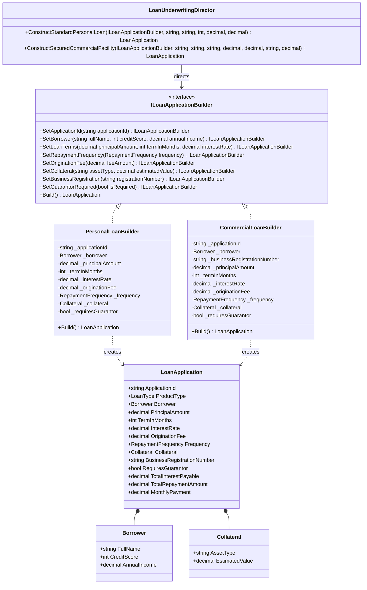

# Builder Pattern

## Description

The Builder pattern is a creational design pattern that separates the construction of a complex object from its representation, allowing the same construction process to create different representations and configurations.

In lending systems, financial contracts such as a **LoanApplication** contain numerous parameters: borrower credit profiles, principal amounts, term durations, amortized interest rates, repayment schedules, origination fee structures, and optional collateral or business registrations. 

Rather than relying on unwieldy constructors with dozens of parameters ("telescoping constructors"), the Builder pattern:

- Assembles complex `LoanApplication` instances step-by-step
- Enforces strict product-specific underwriting invariants and regulatory rules upon `Build()`
- Allows a **Director** (`LoanUnderwritingDirector`) to encapsulate standard, reusable lending product packages
- Allows clients to configure bespoke, customized loan structures fluently

---

## Real-World Analogy: The Loan Origination Desk

Imagine applying for a loan at a commercial bank:

- **The Complex Product (`LoanApplication`):** A finalized loan contract with underwriting terms, monthly repayment amounts, regulatory disclosures, and collateral schedules.
- **The Construction Process (`ILoanApplicationBuilder`):** The loan application steps: collecting borrower income and credit scores, defining requested principal and term, calculating origination fees, and assessing collateral.
- **The Specialized Builders (`PersonalLoanBuilder` / `CommercialLoanBuilder`):** 
  - A *Personal Loan Specialist* validates unsecured lending limits (maximum \$50,000, minimum 600 credit score, consumer disclosure regulations).
  - A *Commercial Loan Specialist* enforces commercial lending covenants (mandatory business registration, minimum \$25,000 facility size, 75%+ collateral asset coverage).
- **The Underwriting Director (`LoanUnderwritingDirector`):** An automated loan origination engine that executes pre-packaged standard financing templates (e.g., "Standard 3-Year Personal Loan", "5-Year Secured Commercial Facility").

```
             [ LoanUnderwritingDirector ]
             (Executes standard recipes)
                         │
                         ▼
             [ ILoanApplicationBuilder ]
                         │
         ┌───────────────┴───────────────┐
         ▼                               ▼
 [ PersonalLoanBuilder ]     [ CommercialLoanBuilder ]
 (Validates unsecured caps)   (Requires collateral & ACN)
         │                               │
         └───────────────┬───────────────┘
                         ▼
                 [ LoanApplication ]
             (Immutable financial product)
```

**Without the Builder Pattern (Telescoping Constructor Anti-Pattern):**
```csharp
// Unreadable, error-prone, hard to maintain, and impossible to validate conditionally
var loan = new LoanApplication(
    "PL-101", LoanType.Personal, "Jane Doe", 740, 95000m, 20000m, 36, 0.089m, 
    300m, RepaymentFrequency.Monthly, null, 0m, null, false);
```

**With the Builder Pattern:**
Construction is expressive, self-documenting, and guarantees that every completed `LoanApplication` is structurally valid and meets compliance criteria before entering the loan servicing pipeline.

---

## UML Diagram



---

## Role Mapping

| Class / Interface | Builder Pattern Role | Description |
|-------------------|----------------------|-------------|
| `LoanApplication` | **Product** | The complex financial object being constructed; immutable once built. |
| `ILoanApplicationBuilder` | **Builder** | Specifies an abstract interface for creating parts of a `LoanApplication`. |
| `PersonalLoanBuilder` | **Concrete Builder** | Builds unsecured personal loans; validates consumer credit scores, maximum loan caps (\$50,000), and term limits. |
| `CommercialLoanBuilder` | **Concrete Builder** | Builds commercial facilities; enforces mandatory business registration, minimum facility size (\$25,000), and 75%+ collateral coverage. |
| `LoanUnderwritingDirector` | **Director** | Encapsulates standard assembly workflows to construct pre-approved financing packages. |

---

## Key Advantages

1. **Eliminates Telescoping Constructors**
   Replaces cumbersome constructors with a clear, readable fluent interface where every parameter is explicit.

2. **Step-by-Step Construction and Deferred Execution**
   Allows parts of the loan application to be gathered incrementally (e.g. across multiple wizard screens or microservice pipeline stages) before invoking `Build()`.

3. **Product-Specific Invariant Validation**
   `PersonalLoanBuilder` and `CommercialLoanBuilder` enforce different risk, credit, and regulatory rules before producing the final object, ensuring no invalid loan contract can be instantiated.

4. **Immutability of the Resulting Domain Entity**
   Properties on `LoanApplication` utilize `{ get; init; }`, ensuring that once the application is created, its terms cannot be mutated unpredictably.

5. **Separation of Assembly Recipes (Director) from Construction Logic (Builder)**
   `LoanUnderwritingDirector` provides reusable templates for standard offerings, while custom or bespoke facilities can be built by chaining builder methods directly.

---

## Scenarios: When to Use the Builder Pattern

### 1. Complex Credit Facilities and Loan Origination
**Scenario:** Loan products involve dozens of interconnected terms: interest rate indices, draw schedules, repayment frequencies, fees, covenants, personal guarantees, and collateral assets. The Builder pattern validates all terms before generating binding legal contracts.

### 2. Multi-Leg Derivative & Structured Trade Orders
**Scenario:** FX Swaps or interest rate caps involve multiple legs (near leg, far leg, settlement currencies, fixing dates, counterparty margin accounts). A `StructuredTradeBuilder` ensures both legs balance and conform to ISDA master agreements.

### 3. Regulatory Disclosure Packages (KYC / AML / Truth in Lending)
**Scenario:** Generating compliance packs requiring jurisdictional disclosures, borrower tax residency forms, and anti-money laundering certifications. A builder assembles the required documents based on the borrower's residency and credit product type.

### 4. Financial Pricing & Quotation Requests
**Scenario:** Building complex loan pricing scenarios with custom risk margins, debt-to-income caps, and fee structures to run through pricing engines.

---

## Builder vs. Other Creational Patterns

| Pattern | Primary Intent | When to Choose Over Builder |
|---|---|---|
| **Builder** | Constructs complex objects step-by-step; separates construction algorithm from representation | When the object has many parameters, optional components, or strict invariant validation rules |
| **Abstract Factory** | Creates families of related or dependent objects | When you need to create entire suites of products that must work together (e.g., Corporate Guarantee + Overdraft) |
| **Factory Method** | Defines an interface for creating a single object, letting subclasses decide which class to instantiate | When the creation logic is simple (one method call) and variations are handled via polymorphism |
| **Prototype** | Creates new objects by copying an existing prototype | When object creation is computationally expensive and cloning an existing state is faster |

---

## Adding a New Loan Builder

To add a new loan category (e.g., a `MortgageLoanBuilder`), you only need to:

### 1. Create a new class implementing `ILoanApplicationBuilder`

```csharp
namespace Builder;

public class MortgageLoanBuilder : ILoanApplicationBuilder
{
    private string? _applicationId;
    private Borrower? _borrower;
    private decimal _principalAmount;
    private int _termInMonths;
    private decimal _interestRate;
    private decimal _originationFee;
    private RepaymentFrequency _frequency = RepaymentFrequency.Monthly;
    private Collateral? _collateral;

    public ILoanApplicationBuilder SetApplicationId(string applicationId)
    {
        _applicationId = applicationId;
        return this;
    }

    public ILoanApplicationBuilder SetBorrower(string fullName, int creditScore, decimal annualIncome)
    {
        _borrower = new Borrower(fullName, creditScore, annualIncome);
        return this;
    }

    public ILoanApplicationBuilder SetLoanTerms(decimal principalAmount, int termInMonths, decimal interestRate)
    {
        _principalAmount = principalAmount;
        _termInMonths = termInMonths;
        _interestRate = interestRate;
        return this;
    }

    public ILoanApplicationBuilder SetRepaymentFrequency(RepaymentFrequency frequency)
    {
        _frequency = frequency;
        return this;
    }

    public ILoanApplicationBuilder SetOriginationFee(decimal feeAmount)
    {
        _originationFee = feeAmount;
        return this;
    }

    public ILoanApplicationBuilder SetCollateral(string assetType, decimal estimatedValue)
    {
        _collateral = new Collateral(assetType, estimatedValue);
        return this;
    }

    public ILoanApplicationBuilder SetBusinessRegistration(string registrationNumber) => this;
    public ILoanApplicationBuilder SetGuarantorRequired(bool isRequired) => this;

    public LoanApplication Build()
    {
        if (_collateral == null || _collateral.EstimatedValue < _principalAmount)
        {
            throw new InvalidOperationException("Mortgages require property collateral covering at least 100% of the loan.");
        }

        return new LoanApplication
        {
            ApplicationId = _applicationId ?? Guid.NewGuid().ToString("N"),
            ProductType = LoanType.Personal,
            Borrower = _borrower ?? throw new InvalidOperationException("Borrower required."),
            PrincipalAmount = _principalAmount,
            TermInMonths = _termInMonths,
            InterestRate = _interestRate,
            OriginationFee = _originationFee,
            Frequency = _frequency,
            Collateral = _collateral
        };
    }
}
```

### 2. What you DON'T need to modify

| File | Required? |
|------|-----------|
| `LoanApplication.cs` | ❌ No |
| `ILoanApplicationBuilder.cs` | ❌ No |
| `PersonalLoanBuilder.cs` / `CommercialLoanBuilder.cs` | ❌ No |
| `LoanUnderwritingDirector.cs` | ❌ No |

---

## Unit Testing with Shouldly

The test suite validates both Director assembly templates and standalone Builder validation rules:

```csharp
[Fact]
public void Director_ShouldConstruct_StandardPersonalLoan()
{
    var director = new LoanUnderwritingDirector();
    var builder = new PersonalLoanBuilder();

    var loan = director.ConstructStandardPersonalLoan(
        builder, "PL-1001", "Jane Doe", creditScore: 740, annualIncome: 95000m, amount: 20000m);

    loan.ShouldNotBeNull();
    loan.ProductType.ShouldBe(LoanType.Personal);
    loan.PrincipalAmount.ShouldBe(20000m);
    loan.TotalInterestPayable.ShouldBe(5340.00m);
    loan.MonthlyPayment.ShouldBe(712.22m);
}

[Fact]
public void CommercialLoanBuilder_ShouldThrow_WhenCollateralIsInsufficient()
{
    var builder = new CommercialLoanBuilder()
        .SetApplicationId("CL-LOW-COLLATERAL")
        .SetBorrower("David Miller", 730, 300000m)
        .SetBusinessRegistration("ACN-111-222")
        .SetLoanTerms(100000m, 48, 0.06m)
        .SetCollateral("Delivery Van", 50000m); // 50% coverage, requires 75%

    var ex = Should.Throw<InvalidOperationException>(() => builder.Build());
    ex.Message.ShouldContain("does not satisfy the 75% coverage requirement");
}
```

