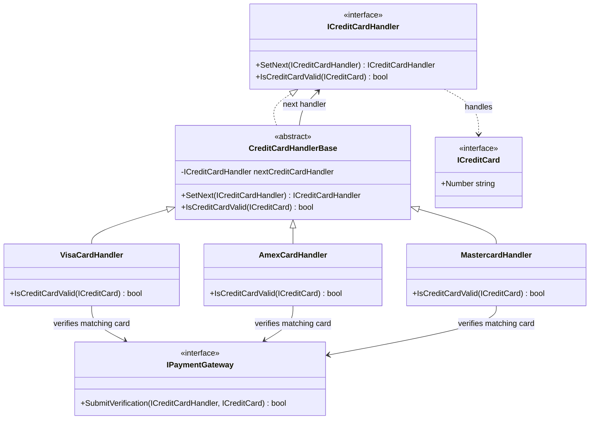

# Chain of Responsibility

## Description

The Chain of Responsibility is a behavioral design pattern that passes a request through a sequence of handlers. Each handler decides whether it can process the request; if not, it passes the request to the next handler. The sender depends on the handler abstraction rather than knowing which concrete handler will handle a request.

In this implementation, credit-card verification starts at the Visa handler and moves through the Amex and Mastercard handlers. A handler whose configured leading digit matches the card submits it to the payment gateway. If no handler matches, the base handler reaches the end of the chain and returns `false`.

## Diagram



## Roles

| Class / Interface | Pattern Role | Responsibility |
| --- | --- | --- |
| `ICreditCardHandler` | Handler | Defines the request operation and `SetNext` for linking handlers. |
| `CreditCardHandlerBase` | Base Handler | Stores the next handler and delegates unmatched cards; returns `false` when the chain ends. |
| `VisaCardHandler` | Concrete Handler | Handles cards whose number starts with `4`. |
| `AmexCardHandler` | Concrete Handler | Handles cards whose number starts with `3`. |
| `MastercardHandler` | Concrete Handler | Handles cards whose number starts with `5`. |
| `ICreditCard` | Request | Supplies the card number inspected by each handler. |
| `IPaymentGateway` | Collaborator | Verifies a matching card and returns the verification result. |

## Request Flow

The client calls `IsCreditCardValid` on the first handler without selecting a card-specific handler. Each concrete handler checks its leading-digit rule. On a match, it submits the handler and card to `IPaymentGateway` and returns the gateway result. Otherwise, it delegates to the next handler. If no handler matches, the base implementation returns `false`.

The chain is assembled with `SetNext`:

```csharp
ICreditCardHandler handlers = new VisaCardHandler(paymentGateway);
handlers.SetNext(new AmexCardHandler(paymentGateway))
        .SetNext(new MastercardHandler(paymentGateway));

bool isValid = handlers.IsCreditCardValid(card);
```

## Benefits

- The caller can submit a card through one entry point without branching on card type.
- Each card handler owns its matching and verification behavior.
- New handlers can be added to the chain without changing the caller.
- The chain can be reordered or configured differently where the application requires it.

## When to Use

Use this pattern when multiple handlers may process a request, the appropriate handler is determined at runtime, and the sender should not be coupled to handler selection. It is also useful for ordered pipelines where each stage may handle, reject, or pass along a request.

This sample checks only the first digit to demonstrate delegation. It is not production card-brand validation and does not check full issuer identification ranges or perform payment-card validation.
